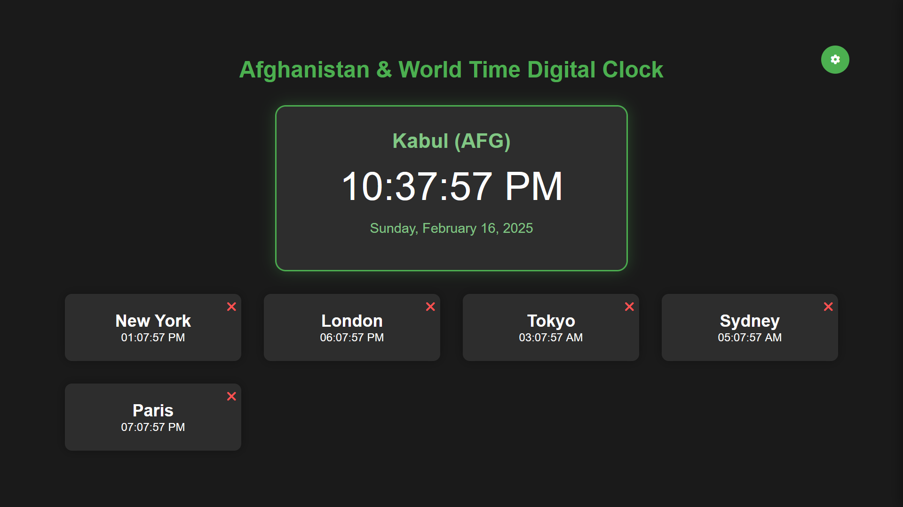

# World Time Digital Clock with Afghanistan Focus


A modern, responsive web application that displays real-time clock information for multiple time zones, with a primary focus on Afghanistan (Kabul) time. This application features customizable time zones, weather information, and persistent user preferences.

## Table of Contents
- [Features](#features)
- [Technology Stack](#technology-stack)
- [Installation](#installation)
- [Usage](#usage)
- [Configuration](#configuration)
- [File Structure](#file-structure)
- [Contributing](#contributing)
- [License](#license)

## Features

### Core Functionality
- 🕐 Real-time clock updates across multiple time zones
- 🇦🇫 Primary focus on Afghanistan (Kabul) time
- 📅 Full date display for the main clock
- 🌍 Support for multiple international time zones

### Customization Options
- ⚙️ Customizable time zone selection
- 🔄 12/24 hour time format toggle
- 💾 Persistent settings using localStorage
- ➕ Add/remove time zones dynamically

### Weather Integration
- 🌤️ Real-time weather information for Kabul
- 🌡️ Temperature display in Celsius
- 💧 Humidity information
- 🔄 Automatic weather updates every 30 minutes

### User Interface
- 📱 Responsive design for all devices
- 🎨 Modern dark theme with green accents
- 🖱️ Intuitive settings panel
- 🔍 Time zone search functionality

## Technology Stack
- HTML5
- CSS3
- Vanilla JavaScript
- OpenWeather API
- Local Storage API

## Screenshots

*(Note: Add actual screenshots of your implementation)*

## Installation

1. Clone the repository:
```bash
git clone https://github.com/NUM2077/world-time-clock.git
```

2. Navigate to the project directory:
```bash
cd world-time-clock
```

3. Configure the weather API:
   - Open `script.js`
   - Replace `YOUR_API_KEY_HERE` with your OpenWeather API key
   - Save the file

4. Open `index.html` in your web browser

## Usage

### Basic Usage
- The main clock displays Kabul time by default
- Additional time zones are shown below
- Weather information is displayed for Kabul (when configured)

### Customizing Time Zones
1. Click the settings icon (⚙️)
2. Use the search box to find time zones
3. Click on a search result to add it
4. Use the (×) button to remove added time zones

### Changing Time Format
1. Open settings
2. Select 12 or 24-hour format
3. Changes apply immediately

## Configuration

### Weather API Setup
1. Get an API key from [OpenWeather](https://openweathermap.org/api)
2. Open `script.js`
3. Locate the `WEATHER_API_KEY` constant
4. Replace `'YOUR_API_KEY_HERE'` with your actual API key

### Local Storage
The application stores the following preferences:
- Selected time format
- Custom time zones
- Weather display preference
- Settings panel state

## File Structure
```
world-time-clock/
├── index.html      # Main HTML file (v3)
├── styles.css      # Stylesheet file (v3)
├── script.js       # JavaScript logic (v3)
└── README.md       # Documentation
```

## Version History

### Current Version (v3.0.0)
- Added customizable time zones
- Integrated weather information
- Implemented persistent storage
- Enhanced UI/UX

## Contributing
1. Fork the repository
2. Create your feature branch (`git checkout -b feature/AmazingFeature`)
3. Commit your changes (`git commit -m 'Add some AmazingFeature'`)
4. Push to the branch (`git push origin feature/AmazingFeature`)
5. Open a Pull Request

## Support
For support, please open an issue in the repository or contact the maintainer.

## License
This project is licensed under the MIT License - see the [LICENSE](LICENSE) file for details.

## Author
- **NUM2077**
- Last Updated: 2025-02-16 18:01:56 UTC

## Acknowledgments
- OpenWeather API for weather data
- Font Awesome for icons
- Contributors and users of the application

---
© 2025 World Time Digital Clock.